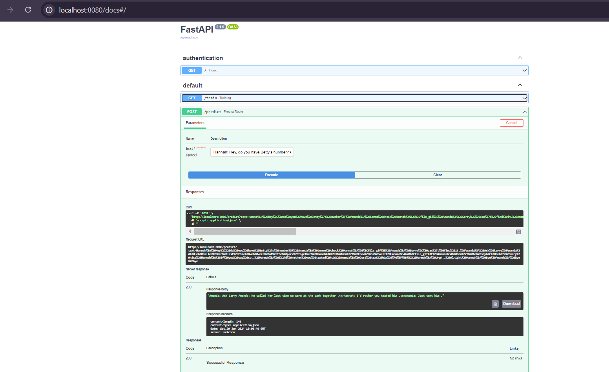

# End to end Text-Summarizer-Project

## Text_Summarization_Result:
- 
- Authontication
- 
- Training Successfully Completed
- 
- Summarize this Dialog 
- Text_Summerization_Completed and Result is **Amanda: Ask Larry Amanda: He called her last time we were at the park together .<n>Hannah: I'd rather you texted him .<n>Amanda: Just text him.**
- 

###### Workflows
1. Update config.yaml
2. Update params.yaml
3. Update entity
4. Update the configuration manager in src config
5. update the conponents
6. update the pipeline
7. update the main.py
8. update the app.py
###### How to run?
```bash
# Clone Repositories 
https://github.com/praveenaiiisc/Text-Summarization-NLP-Project.git
conda create -n summary python=3.8 -y
conda activate summary
pip install -r requirements.txt
# Finally run the following command for creating App
python app.py
